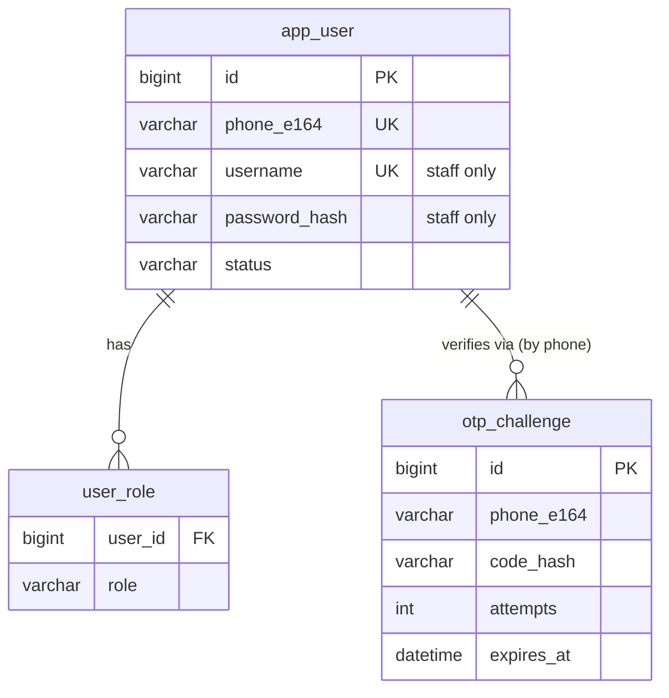
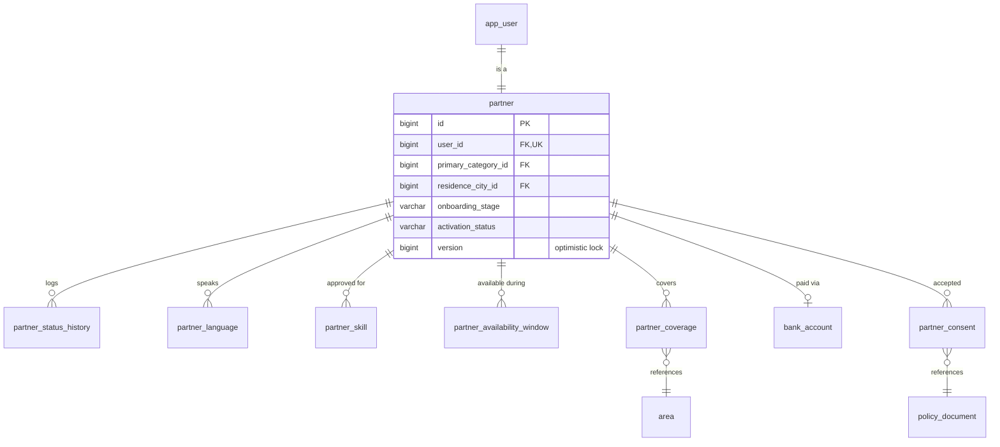
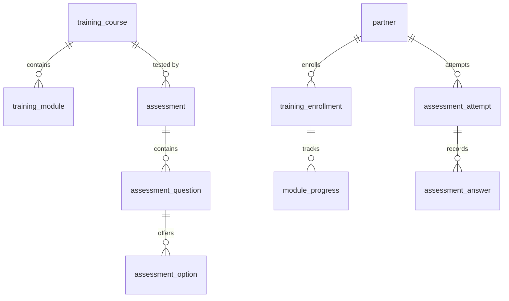
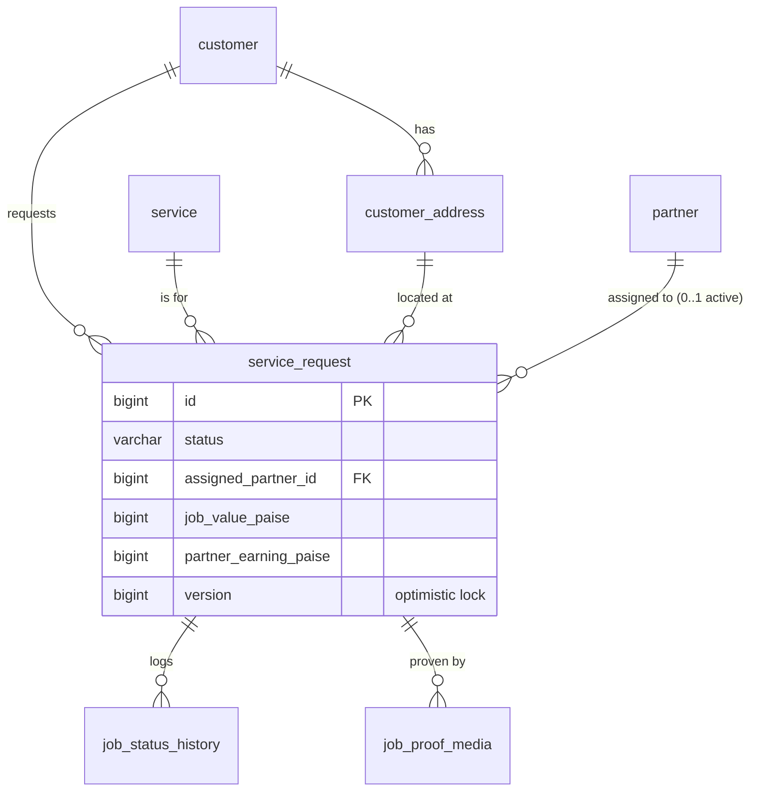
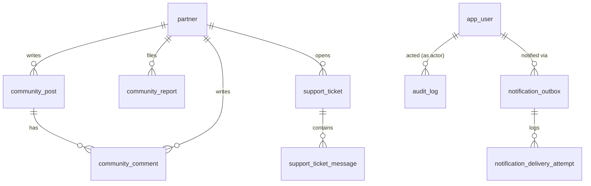

# Entity-relationship diagram

Grouped by domain for readability (the full schema is ~50 tables across
`backend/src/main/resources/db/migration/V1..V10`). Every cross-domain
reference is a plain FK `Long` column, not a JPA object association — see
`docs/ASSUMPTIONS.md` for why packages are wired that way.

## Identity & auth



## Catalog

```mermaid
erDiagram
    category ||--o{ service : contains
    service ||--|| service_requirement : configures
    city ||--o{ area : contains
    category ||--o{ category_city_estimate : "estimate for"
    city ||--o{ category_city_estimate : "estimate for"

    category { bigint id PK }
    service { bigint id PK; bigint category_id FK }
    service_requirement { bigint service_id PK,FK; boolean starter_kit_required; bigint required_course_id FK }
    city { bigint id PK }
    area { bigint id PK; bigint city_id FK }
    category_city_estimate { bigint id PK; varchar hours_choice; bigint estimated_monthly_paise }
    policy_document { bigint id PK; varchar type; varchar version; boolean is_current }
```

## Partner core



## Verification & screening

```mermaid
erDiagram
    partner ||--o{ identity_document : uploaded
    partner ||--|| verification_request : "reviewed via"
    screening_slot ||--o{ screening_booking : "booked as"
    partner ||--o{ screening_booking : books
    screening_booking ||--o{ screening_booking_history : logs

    verification_request { bigint id PK; bigint partner_id FK,UK; varchar provider; varchar status }
    screening_slot { bigint id PK; int capacity; int booked_count; bigint version }
    screening_booking { bigint id PK; bigint slot_id FK; bigint partner_id FK; varchar status; varchar outcome }
```

## Starter kit

```mermaid
erDiagram
    category ||--o{ starter_kit : "kit for"
    starter_kit ||--o{ starter_kit_item : contains
    starter_kit ||--o{ kit_order : ordered_as
    partner ||--o{ kit_order : places
    kit_order ||--o{ kit_order_event : logs

    kit_order { bigint id PK; bigint partner_id FK; bigint kit_id FK; varchar idempotency_key UK; varchar status }
```

## Training



## Jobs



## Money

```mermaid
erDiagram
    service_request ||--o| earning_entry : "earns (exactly once)"
    partner ||--o{ earning_entry : earns
    partner ||--o{ earning_adjustment : adjusted
    earning_entry ||--o{ earning_adjustment : "reversed by"
    partner ||--o{ payout : requests
    bank_account ||--o{ payout : "paid to"
    payout_batch ||--o{ payout : batches
    payout ||--o{ payout_event : logs

    earning_entry { bigint id PK; bigint service_request_id FK,UK; bigint net_paise; varchar status }
    payout { bigint id PK; bigint partner_id FK; bigint amount_paise; varchar status }
```

## Community, support, notifications, audit


